<!--
アプリ説明書（さんあ〜る担当者・その上長向け）v0.2 / 2026-06-27
用途: 画面ごとに「何ができて／どの公式データに基づくか」を、スクショ付きで説明する。
      担当者がそのまま上長へ回覧できる体裁を意識。
スクショ: docs/pitch/screenshots/ の .jpg を参照（撮影指示は同フォルダ README.md）。
      02/07/11 は2枚構成（_2 が続き画面）。
方針: data-provenance.md と整合させる（出典の言い回しを揃える）。
-->

# 「これどう捨てる？」アプリ説明書（ベータ版）

開発元: ほほ笑みラボ（飯田市）／ rabo.hohoemi@gmail.com

> **一言でいうと**: ごみを撮るだけで「飯田市での捨て方」が分かる、市民向け・無料の Android アプリ。
> **設計の肝**: AI は「品目名」を当てるだけ。分別ルールは **飯田市公式データ由来のアプリ内辞書** から表示します（AI にルールを推測させない設計）。出典の詳細は別紙「データ出典・照合 説明資料」（`data-provenance.md`）参照。

---

## 1. ホーム画面

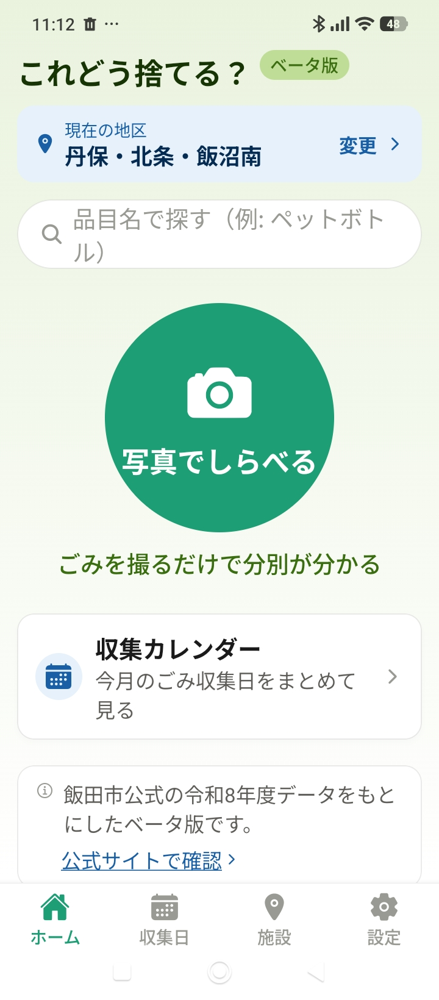
*① ホーム — 地区表示・写真でしらべる・文字検索・収集カレンダー*

- 上部に **現在の地区**を表示（タップで変更）。分別・収集日は地区ごとに異なるため、最初に地区を選びます。
- 中央の大きなボタンが **カメラ判定**、上部が **文字検索**、下が **収集カレンダー**。
- 画面に「**ベータ版**」「**飯田市公式の令和8年度データをもとにしたベータ版です／公式サイトで確認**」を明示し、**市公式アプリではない**ことが分かる作りです。

## 2. カメラで撮る

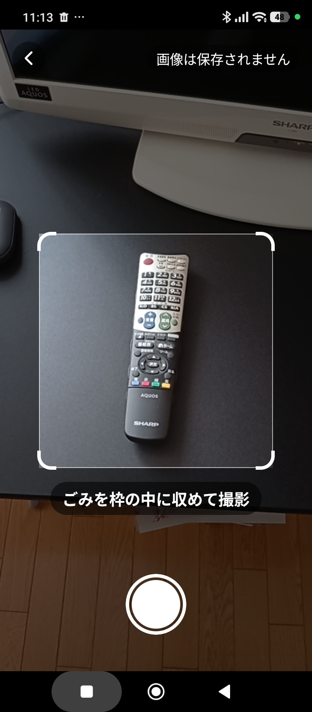
*② カメラ — 品目を枠に収めて撮影。右上に「画像は保存されません」*

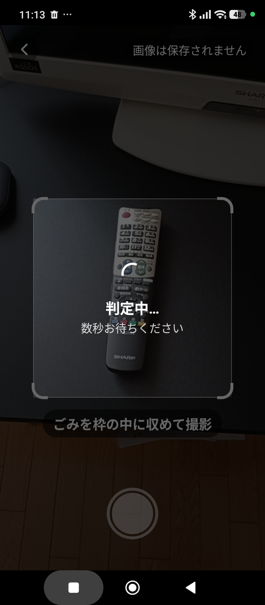
*②' 撮影後「判定中…」（数秒）*

- 品目を枠内に収めて撮影します。枠の外は判定対象から外します。
- **重要**: 画面に「**画像は保存されません**」と明記。撮影画像は判定後すぐ破棄し、**サーバーにもログにも残しません**（ログイン不要・個人情報の取得は最小）。

## 3. 判定結果（分別ルールの表示）

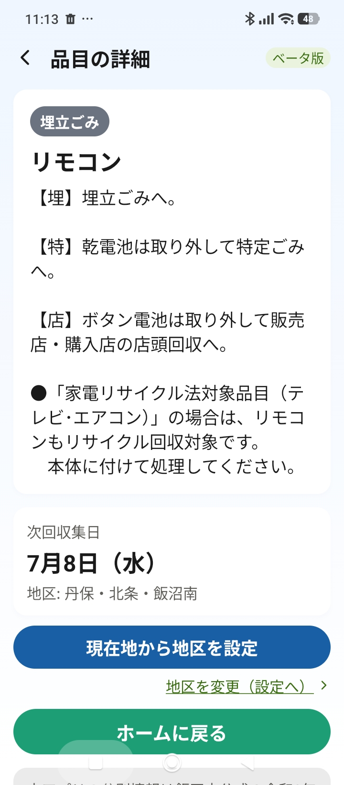
*③ 結果（例: リモコン）— 分別カテゴリ・出し方・次回収集日*

- AI が特定した品目名（この例では「リモコン」）をもとに、アプリ内辞書から **分別カテゴリ（埋立ごみ）・出し方の注意・次回収集日** を表示します。
- ここに出る分別ルールは **飯田市公式データ由来**（品目＝さんあ〜る／収集日＝令和8年度計画表PDF）。AI が独自に判断したものではありません。
- 「乾電池は取り外して特定ごみへ」「家電リサイクル法対象品の場合は…」など、**部品ごとの出し方**も公式データのまま表示します。注意文中の電話・URL はタップで発信・表示できます。

## 4. 辞書に無いとき（未収録品目の報告）

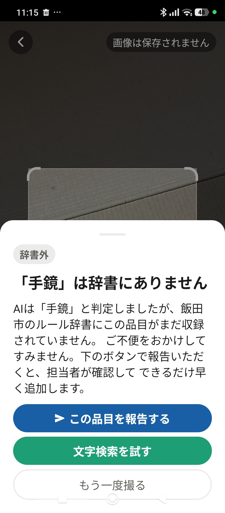
*④ 辞書に無い品目（例: 手鏡）—「この品目を報告する」ボタン*

- AI が品目名を返しても、辞書（公式データ由来）に無い場合は **正直に「辞書にありません」と表示**します（推測で誤案内しない）。
- 利用者が **「この品目を報告する」** を押すと、その品目名が運用側に届きます。

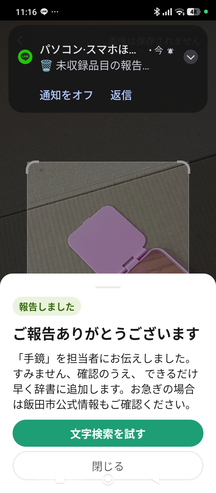
*⑤ 報告後「ご報告ありがとうございます」（同時に運用側へ通知が飛ぶ）*

- 報告で送るのは **品目名のテキスト・地区名のみ**。**画像・位置情報・個人を特定する情報は送りません**。押さない限り送信もしません。

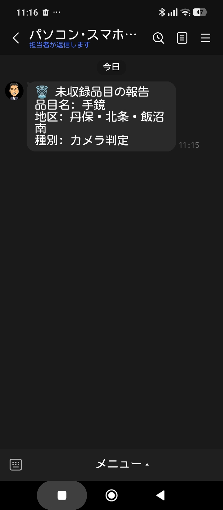
*⑥ 運用側（開発者）に届く通知の例（LINE）*

- 報告は運用者の端末（LINE）に「品目名・地区・種別（カメラ判定/文字検索）」付きで届き、確認して辞書に追加 → アプリへ反映（再申請不要）という流れです。
- **市への価値**: これが集まると「**市民が実際に困っている＝公式データに無い品目リスト**」になり、市のデータ整備・問い合わせ削減に還元できます。

## 5. 文字検索

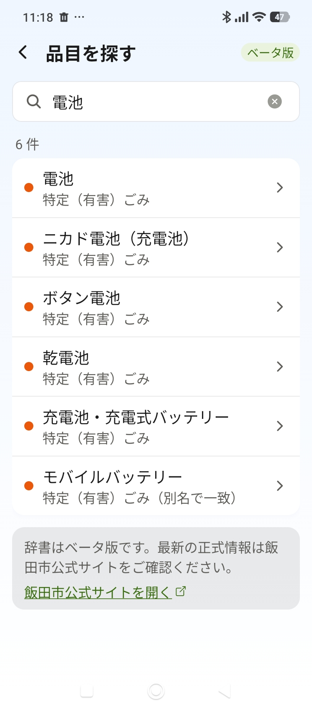
*⑦ 文字検索（例:「電池」で6件）*

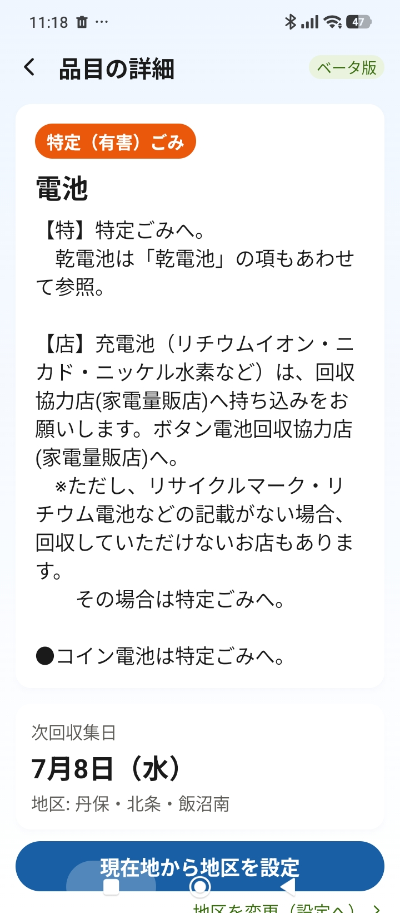
*⑦' ヒットをタップ → 品目の詳細（電池 → 特定(有害)ごみ・次回収集日）*

- カメラを使わず、品目名・別名で検索できます（ひらがな/カタカナの違いも吸収。「モバイルバッテリー」のように**別名で一致**したものも表示）。
- ヒットをタップすると、③と同じ結果画面に進みます。表示内容の出典は品目辞書＝さんあ〜る。

## 6. 収集カレンダー

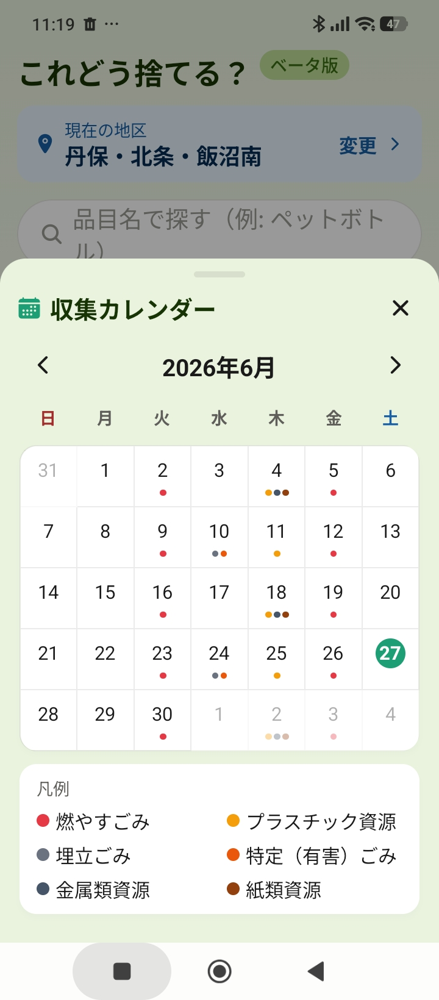
*⑧ 収集カレンダー（ポップアップ）— 日曜始まり・カテゴリ色・凡例*

- ホームのボタンから、月カレンダーをポップアップ表示。収集のある日にカテゴリ色のドットが付きます（今日は緑の丸）。
- 日付をタップすると、その日の収集内容が出ます。出典は令和8年度計画表PDF（地区別）。

## 7. 収集日（一覧）

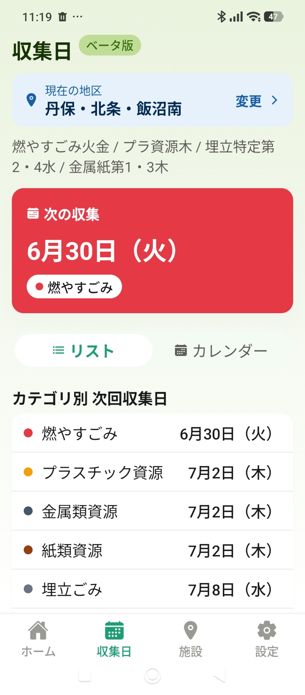
*⑨ 収集日 — 次の収集・リスト/カレンダー切替・カテゴリ別の次回日*

- 自分の地区の「次の収集」「カテゴリ別の次回収集日」「今後の予定」を一覧表示。地区ごとの収集パターン（例:「燃やすごみ火金 / プラ資源木 / 埋立特定第2・4水 …」）も表示します。
- 前日に「明日は○○の日」と知らせる **通知**も設定できます。

## 8. 施設・リサイクルステーション

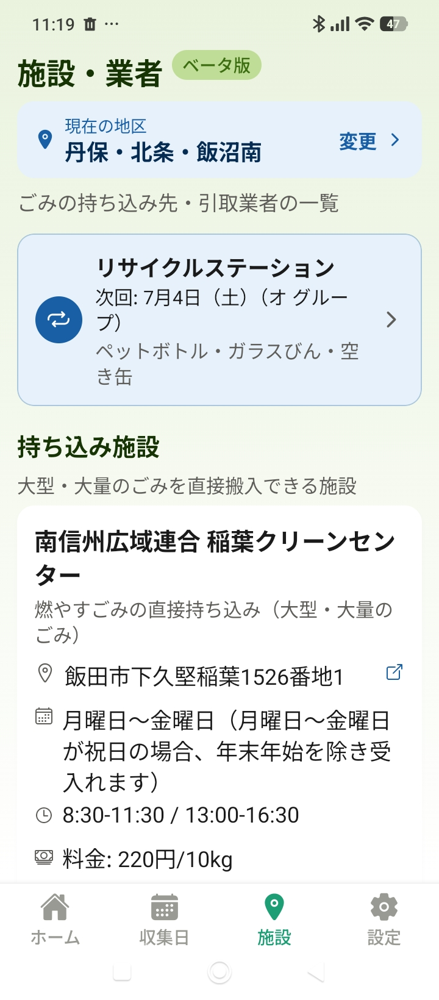
*⑩ 施設・業者 — リサイクルステーション次回開催・持ち込み施設*

- リサイクルステーションの次回開催日・受入品目、持ち込み施設（稲葉クリーンセンター等）の住所・営業日・時間・料金を表示。地図リンクで案内も可能。
- 出典は令和8年度計画表PDF／ガイドブック。

## 9. 設定・法務

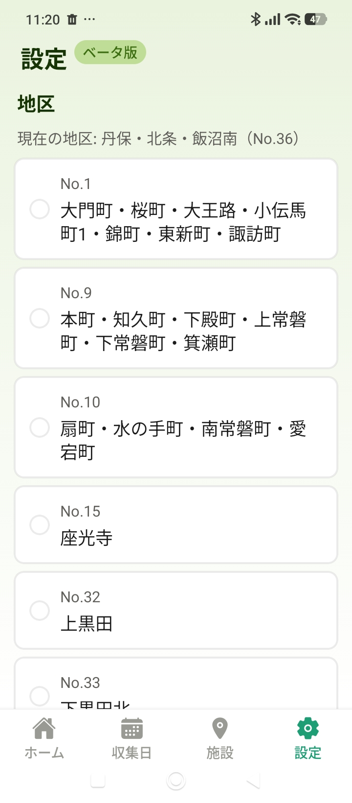
*⑪ 設定 — 地区の選択（現在の地区を表示）*

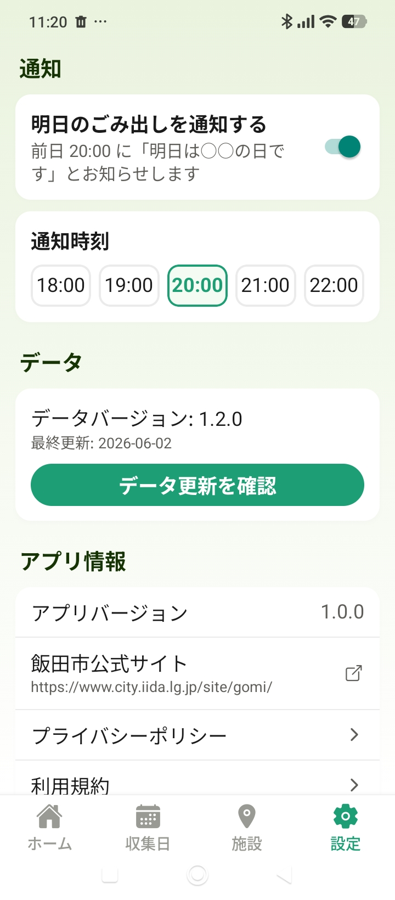
*⑪' 設定 — 通知ON/時刻・データ更新・プライバシーポリシー/利用規約*

- 地区の変更、通知の ON/OFF・時刻、**データ更新の確認**（公式更新を再申請なしで反映）、プライバシーポリシー・利用規約を確認できます。
- プライバシーポリシーには、撮影画像を保存しないこと、報告機能が任意（ボタン押下時のみ・テキストのみ）であることを明記しています。

---

## 付録: データの出典まとめ（要点）

| 表示している情報 | 出典 |
|---|---|
| 品目→分別区分・出し方 | 飯田市公式「さんあ〜る」589品目（delight-system） |
| 収集日・収集パターン | 飯田市 分別収集計画表 令和8年度（PDF・10区） |
| 施設・リサイクルステーション・基本ルール | 同 計画表PDF／ごみ出しガイドブック |
| 画像→品目名 | Google Gemini（品目名の特定のみ。ルールには関与しない） |

詳細は別紙「データ出典・照合 説明資料」（`data-provenance.md`）。

※ 本アプリはベータ版です。分別の最終確認は飯田市公式情報をご参照ください。／ ほほ笑みラボ・rabo.hohoemi@gmail.com
